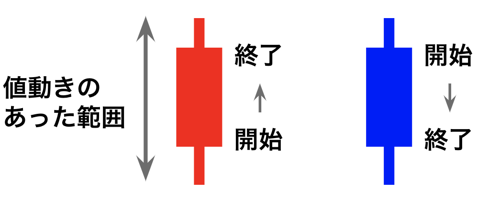
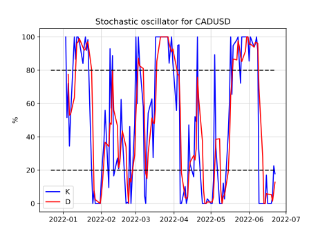

# FX入門
## 背景
- 海外と比較して日本人で投資している人は少ない
- 海外では投資が流行っている
    - FIREムーブメント
- 時系列データコンペ増えている
- FXは難しいイメージがある

## 目的
- 投資の1つであるFXの知識を身につける
- 特徴量作成の参考になる
- Pythonで為替データを扱えるようになる

## FXの基礎

- FX = Foreign eXchange = 外国為替取引
- 異なる通貨を交換(売買)すること
- 外国の通貨に交換しないことは, 円に投資していると考えることもできる
- さまざまな通貨ペアをやりとり可能
    - USD/JPY, CAD/JPY, EUR/JPY, AUD/NZD, USD/CAD, EUR/GBP, EUR/USD, AUD/JPY, AUD/USD, NZD/JPY, NZD/USD, GBP/JPY, GBP/USD, …

### 注文

- 買い注文 / 売り注文
    - 買い: 上がったら得をする注文
    - 売り: 下がったら得をする注文
        - Q. なぜ持っていない通貨を売れるの？
        - A. 自分のお金で市場を操作していると考えると良い

- ポジション / 決済
    - ポジション: 注文が成立して保持しているもののこと
    - 決済: ポジションを手放すこと
- 評価損益: 決済前ポジションの注文時の価格と現在の価格の差
    - 含み損: 評価損益がマイナスのときに使われる
    - 含み益: 評価損益がプラスのときに使われる
- 注文方法
    - 成行: 現在の価格で注文
    - 指値 / 逆指値: 取引の価格を指定(予約)
        - 指値: X円以下になったら買う / X円以上になったら売る
        - 逆指値: X円以上になったら買う / X円以下になったら売る
    - イフダン注文: 「X円で買って, その後Y円で売りたい」というセット注文

### スプレッド

- 買い注文と売り注文価格の差 = 取引手数料
    - FX会社によって異なる
- bid(売): 120.74, ask(買): 120.75 → 0.01円
- 買った瞬間売るとスプレッド分損をする

### レバレッジ
- FXでは資金の25倍の額まで取引可能
    - 最大レバレッジ25倍
    - 例: 1ドル120円のとき, 1000ドル買うのに必要な最低資金は, 120 x 1000 / 25 = 4800円 (必要証拠金)
- 用意する資金でリスクコントロール可能
    - 例: 1ドル120円で1000ドル買ったが, 資金を24000円用意していたら, 120 x 1000 / 24000 = 5倍 (実質レバレッジ)

### ロスカット
- FX会社が損失拡大を防ぐためにポジションを強制決済すること
    - 利用者の損失を最小限に抑えるための仕組み
    - 利用者がポジションを決済して損失を確定させる損切りとは異なる
- ロスカットするラインはFX会社ごとに異なる
    - 例: 評価金額 < 必要証拠金 → ロスカット
- 用意する資金でロスカットレートを調整し, リスクコントロールする
    - 例: リーマンショックで下がったところまでは, 耐えれるようにしておく
        - 2008年リーマンショック後, 2011年まで下がり続け, 75.84円まで下がった
            - Aさん「75円まで耐えられるようにしよう」
            - Bさん「70円まで耐えられるようにしよう」

### ロスカットレート
- ロスカットする金額のこと
- 例: ロスカット条件「評価金額 < 必要証拠金」
    - 資金: 24000円
    - 1ドル120円で1000ドル買うときp円でロスカット
        - ロスカット時の必要証拠金 = p x 1000 / 25 = 40p
    - 「資金 - 含み損 = 必要証拠金」の方程式を解けば良い
        - 24000 - (120 - p) x 1000 = 40p
        - p = 100円 (ロスカットレート)
- FX会社によっては, 注文時に自動的に計算してくれる

### スワップ
- 通貨ペア間の金利差
    - 金利の高い通貨を買う → プラススワップ (利益)
    - 金利の高い通貨を売る → マイナススワップ (損)
- ポジションを持っていると毎日スワップが溜まっていく
- 現在日本はマイナス金利
    - 例: 日本円を売って米ドルを買うとプラススワップ
    - 「政策金利」で調べると各国の金利がわかる

### ローソク足チャート

- 色
    - 赤: 上昇
    - 青: 減少
- 線: 動いた範囲
- 箱: 開始から終了までの動き

## 特徴
- 注文単位
    - 1000通貨
        - 例: 1ドル120円を1000通貨買うのに必要な最低資金は, 120 x 1000 / 25 = 4800円
    - 1万通貨
- 土日以外の24時間
- 大きく動く要因
    - 雇用統計発表
    - 政策金利変更
    - 重要人物の発言
    - 有事
- FXはCFDの一種 (Contract for Difference = 差金決済取引)
    - 株価指数 (日経225, NYダウなど): レバレッジ10倍
    - 商品 (金, 原油など): レバレッジ20倍
    - 株式: レバレッジ5倍
    - 為替 (ドル円など): レバレッジ25倍
- 地理的に近く, 同じような動きをする国はショック相場に強く, レンジ相場になりやすい
    - AUD/NZD
    - USD/CAD
- 仮想通貨との税の制度の違い
    - FX: 分離課税の雑所得 20.315%
        - 「先物取引に係る雑所得等」という区分
        - 給与所得とは別で計算される
        - 株も分離課税
    - 仮想通貨: 総合課税の雑所得 15%-55%
        - 給与所得との合計に課税される
        - 給与所得が多いほど税率が上がる (累進課税)

## チャート予測
チャートを完全に予測できれば億万長者だが...
- 外的要因が多くあり, そもそも予測は難しい
- 上がるか下がるかの2値分類で高いスコアが出ても
    - 実際にはスプレッドもある
    - 何円で決済するべきか不明
- 為替を予測するモデルを作ってグラフを描くと, それっぽく見えるため注意
    - 前日の値を出力するだけでうまく予測できているように見える
- 仮に高精度で予測できるモデルができたとしても, みんながそれを利用するようになると傾向が変化する

## 手動売買 / 自動売買
- 手動売買
    - 欲が入ると失敗する
        - 「まだ上がるだろう」→「下がってしまって決済タイミングを逃した」
    - 見張っておく労力が発生する
- 自動売買
    - 仕組みのわからない自動売買は危険
        - ルールが明確で, カスタマイズできるものがよい
            - 例: イフダン注文を並べるだけ
    - 高い年利を謳っているものは危険
        - 30%以上はあやしい
        - 安全な投資では10%を一つの目安にするとよい

どちらを使うにしても, 自分の中で欲に影響されないルールを作っておくと良い

## 分散投資と相関

- 複数の通貨に分散投資する
- 相関
    - 正の相関
        - 買いと売り
    - 負の相関
        - 買いと買い
        - 売りと売り
- 自分が想定したロスカットレートを超えても, 他の通貨用の資金に余裕がある状態なら耐えられるようになる
- 相関の高いペア CAD/JPY と EUR/JPY の例
    - FX口座に200万
        - CAD/JPY買い100万円用意: ロスカットレート70
        - EUR/JPY売り100万円用意: ロスカットレート160
    - CAD/JPY=70ときに, EUR/JPYのポジションを20万円分しか持っていない状況とすると
        - 180万円分の資金をCAD/JPYに使えるため, ロスカットレートが下がる
        - CAD/JPYとEUR/JPYがともに下がるなら, CAD/JPYの含み損の一部がEUR/JPYの含み益によって相殺される
    - イフダンの仕掛け方によっては, 100万円だけで両方の通貨に同時に仕掛ける事が可能
        - 片方がすべてポジションを持つときは, もう片方はすべて決済されるようにする
        - 相関が高いという仮定の下

- 長い目で見て相関が低く見えても, 時期によって異常に相関が高いこともあるため注意

## FXを選んだ理由
- 細かく利益確定したい
    - 株は上がり続けることを期待するため長期保有するほうがいい
    - 為替は振動するので, 細かく利確するほうがいい
- 確定した利益の再投資で複利パワー発揮
    - 株は持ち続けるのが良いと考えると, 配当金のみが確定利益
- 確定利益で年利10%を目指したい
    - レバレッジがあるため資金以上にお金を動かせる
- イフダンを並べて放置でOK (自動売買)
    - 利益は累積されるが損失は確定されない (ロスカットさえしなければ)
    - 他の人の設定を真似可能 (再現性)

ロスカットリスク/含み損を抱える可能性を把握した上で運用しよう

## テクニカル分析
意味があるのか謎だが, 特徴量作成の参考にはなるかも

- 単純移動平均
    - なめらかになる
    - 価格トレンドの方向や強さを見る

- ボリンジャーバンド
    - 上のバンドをはみ出たら上昇トレンド, 下のバンドをはみ出たら下降トレンド
    - 移動平均 ± 標準偏差 x k
        - k=1: 約68.3%
        - k=2: 約95.4%
        - k=3: 約99.7%

- RSI (Relative Strength Index)
    - 相場の相対的な強弱を表す指標
    - 買われすぎ/売られすぎを判断するための指標
    - RSI = 100 - 100/(RS+1)
        - RS = 上昇量の移動平均 / 下降量の移動平均

- MACD (Moving Average Convergence/Divergence)
    - MACDとMACDシグナルの2本のラインの交差点が売買のタイミングとして用いられる
        - MACD = 短期EMA - 長期EMA
            - EMA: 指数平滑移動平均線
        - MACDシグナル = MACDのEMA

- ストキャスティクス
    - K = (終値 - n日間のmin)/(n日間のmax-n日間のmin) x 100
    - D = (終値 - n日間のmin)のm日合計 / (n日間のmax-n日間のmin)のm日合計 x 100
    - 買いシグナル: K, D共に20%以下で, KがDを下から上に抜いた時
    - 売りシグナル: K, D共に80%以上で, KがDを上から下に抜いた時

## Pythonで扱う
- データの取得
    - 1日単位の取得: pandas_datareader
    - 1日より細かい単位の取得: yfinance
- ローソク足チャート: mplfinance

## まとめ
- FXの基本的な知識とテクニカル分析を説明
- pythonでデータ取得できる

重要ポイント
- レバレッジをかけすぎず, 適切なロスカットレートに
- FXは分離課税
- 分散投資しよう
- テクニカル分析は気休めに過ぎない

