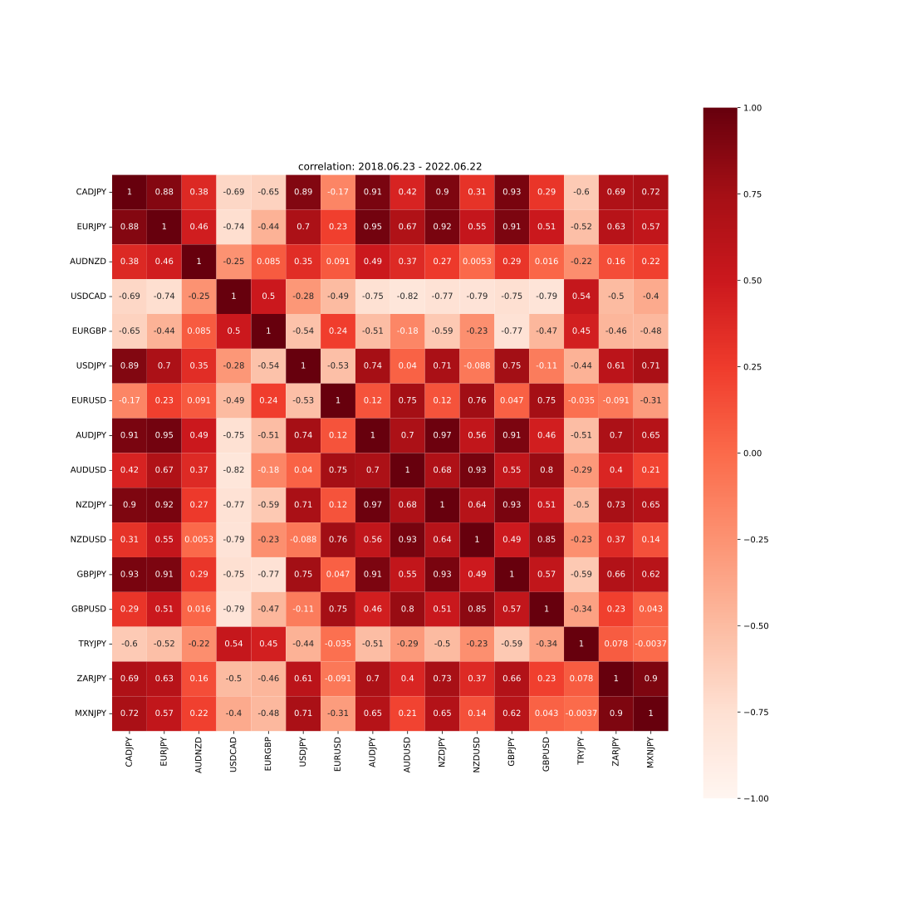

# FX入門
## 背景
- 投資が流行っている
    - FIREムーブメント
- 時系列データコンペ増えている
    - 特徴量作成の参考に
- 知識くらいは身に着けておくと良い

## FX基礎
- FX = Foreign eXchange = 外国為替取引
- 異なる通貨を交換(売買)すること
- 外国の通貨に交換しないことは、円に投資していると考えることもできる
- さまざまな通貨ペアをやりとり可能
    - USD/JPY, CAD/JPY, EUR/JPY, AUD/NZD, USD/CAD, EUR/GBP, EUR/USD, AUD/JPY, AUD/USD, NZD/JPY, NZD/USD, GBP/JPY, GBP/USD, …

### 注文
- 買い注文 / 売り注文
    - 買い: 上がったら得をする注文
    - 売り: 下がったら得をする注文
- ポジション / 決済
    - ポジション: 注文が成立して保持しているもののこと
    - 決済: ポジションを手放すこと
- 評価損益: 決済前ポジションの注文時の価格と現在の価格の差
    - 含み損: 評価損益が損をしているときに使われる
    - 含み益: 評価損益が得をしているときに使われる
- 注文方法
    - 成行: 現在の価格で注文
    - 指値 / 逆指値: 取引の価格を指定(予約)
        - 指値: 今より安くなったら買う / 今より高くなったら売る
        - 逆指値: 今より高くなったら買う / 今より安くなったら売る
    - イフダン注文: 「X円で買って, その後Y円で売りたい」という注文

### スプレッド
- 買い注文と売り注文価格の差 = 取引手数料
    - FX会社によって異なる
- bid(売): 120.74, ask(買): 120.75 → 0.01円
- 買った瞬間売るとスプレッド分損をする

### レバレッジ
- FXでは資金の25倍の額まで取引可能
- 用意する資金でリスクコントロール可能

### ロスカット
- 損失拡大を防ぐためにポジションを強制決済すること
    - 利用者の損失を最小限に抑えるために
- ロスカットするラインはFX会社ごとに異なる
    - 例: 評価金額 < 必要証拠金 → ロスカット
- 用意する資金でロスカットレートを調整し, リスクコントロールする
    - 例: リーマンショックで下がったところまでは, 耐えれるようにしておく

### スワップ
- 通貨ペア間の金利差
    - 金利の高い通貨を買う → プラススワップ
    - 金利の高い通貨を売る → マイナススワップ
- ポジションを持っていると毎日スワップが溜まっていく
- 現在日本はマイナス金利
    - 例: 日本円を売って米ドルを買うとプラススワップ
    - 「政策金利」で調べると各国の金利がわかる

### ローソク足チャート

- 色
    - 赤: 上昇
    - 青: 減少
- 線: 動いた範囲
- 箱: 開始から終了までの動き

## 特徴
- 注文単位
    - 1000通貨
        - 例: 1ドル120円を1000通貨買うのに必要な最低資金は, 120 x 1000 / 25 = 4800円
    - 1万通貨
- 土日以外の24時間
- 大きく動く要因
    - 雇用統計発表
    - 政策金利変更
    - 重要人物の発言
- 仮想通貨との税の制度の違い
    - FX: 分離課税の雑所得 20.315%
        - 「先物取引に係る雑所得等」という区分
        - 給与所得とは別で計算される
        - 株も分離課税
    - 仮想通貨: 総合課税の雑所得 15%-55%
        - 給与所得との合計に課税される
        - 給与所得が多いほど税率が上がる (累進課税)
- 長い目で見ると, 株は右肩上がり, (通貨にも寄るが)為替はレンジ相場
    - 特に地理的に近く, 同じような動きをする国
        - AUD/NZD
        - USD/CAD

## 予測
- 外的要因が多くあり, そもそも予測は難しい
- 上がるか下がるかの2値分類で高いスコアが出たとしても, 実際にはスプレッドもあるので注意
- 予測値と実際の値のプロットに騙されないように
    - 前日の値を出力するだけで見た目はそれっぽく見える
- 仮に高精度で予測できるモデルができ, みんながそれを利用するようになるとまた傾向が変化する
- 仕組みのわからない自動売買は危険
- 年利高いのは詐欺の可能性
    - 30%以上はあやしい
    - 安全な投資では10%を目安にするとよい

## 分散投資と相関

- 正の相関
    - 買いと売り
- 負の相関
    - 買いと買い / 売りと売り
- 自分が想定したロスカットレートを超えても, 他の通貨用の資金に余裕がある状態なら耐えられるようになる
- 相関の高いペア CAD/JPY と EUR/JPY の例
    - FX口座に200万
        - CAD/JPY買い100万円用意: ロスカットレート70
        - EUR/JPY売り100万円用意: ロスカットレート160
    - CAD/JPY=70ときに, EUR/JPYのポジションを20万円分しか持っていない
        - 180万円分の資金をCAD/JPYに使えるため, ロスカットレートが下がる
        - CAD/JPYとEUR/JPYがともに下がるなら, CAD/JPYの含み損の一部がEUR/JPYの含み益によって相殺される
    - イフダンの仕掛け方によっては, 100万円だけで両方の通貨に同時に仕掛ける事が可能
        - 片方がすべてポジションを持つときは, もう片方はすべて決済されるようにする
        - 相関が高いという仮定の下

- 長い目で見て相関が低く見えても, 時期によって異常に相関が高いこともあるため注意

## テクニカル分析
意味があるのか謎だが, 特徴量作成の参考にはなるかも

- 単純移動平均

- ボリンジャーバンド
    - 上のバンドをはみ出たら上昇トレンド, 下のバンドをはみ出たら下降トレンド
    - 移動平均 ± 標準偏差 x k
        - k=1: 約68.3%
        - k=2: 約95.4%
        - k=3: 約99.7%

- RSI
    - 相場の相対的な強弱を表す指標
    - Relative Strength Index
    - 買われすぎ/売られすぎを判断するための指標

- MACD
    - MACDとMACDシグナルの2本のラインの交差点が売買のタイミングとして用いられる
        - MACD = 短期EMA - 長期EMA
        - MACDシグナル = MACDのEMA

- ストキャスティクス
    - K = (終値 - n日間のmin)/(n日間のmax-n日間のmin) x 100
    - D = (終値 - n日間のmin)のm日合計 / (n日間のmax-n日間のmin)のm日合計 x 100
    - 買いシグナル: K, D共に20%以下で, KがDを下から上に抜いた時
    - 売りシグナル: K, D共に80%以上で、KがDを上から下に抜いた時

